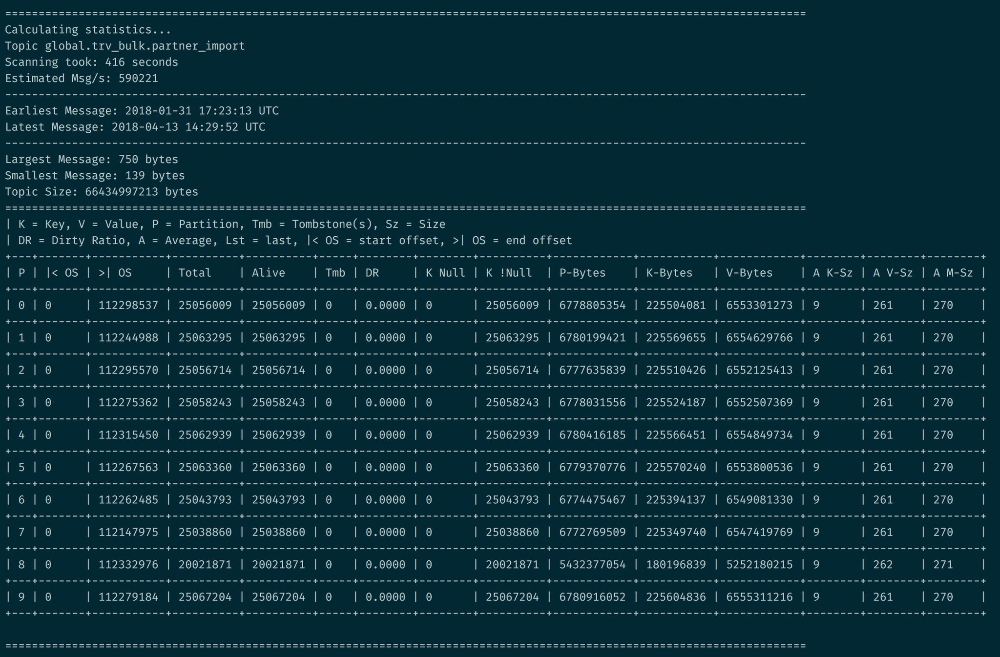

# Kafka Topic Analyzer

A CLI tool that gathers statistics about a Apache Kafka topic by reading
it from beginning to end and counting various metrics.

## Usage
    $> ./kafka-topic-analyzer -h
         Kafka Topic Analyzer

         USAGE:
             kafka-topic-analyzer [OPTIONS] --bootstrap-server <BOOTSTRAP_SERVER> --topic <TOPIC>

         FLAGS:
             -h, --help       Prints help information
             -V, --version    Prints version information

         OPTIONS:
             -b, --bootstrap-server <BOOTSTRAP_SERVER>                 Bootstrap server(s) to work with, comma separated
             -c, --count-alive-keys <LOCAL_ALIVE_KEYS_STORAGE_PATH>
                     Counts the effective number of alive keys in a log compacted topic by saving the state for each key in a
                     local file and counting the result at the end of the read operation
             -t, --topic <TOPIC>                                       The topic to analyze

## Example output

## Installation

By now, the only way of installing it is building it from source or
via `cargo install kafka-topic-analyzer`. In both cases you need to
have the rust toolchain installed via [http://rustup.rs/](http://rustup.rs/).

### Dependencies

#### librdkafka
When installed from source, the binary can build librdkafka as part of the
dependency resolution process. Please see the [rdkafka-rust dependency documentation](https://github.com/fede1024/rust-rdkafka/#installation)
for the detailed requirements.

The `rdkafka-rust` dependency exports a feature flag, which enables
dynamic linking of the librdkafa dependency.

You can compile this project with `cargo build --features "dynamic_linking"`
in order to use the shared library instead of building it with the dependencies.

#### rocksdb
In order to support the active key counting feature, this tool builds
against [RocksDB](https://github.com/spacejam/rust-rocksdb/).
